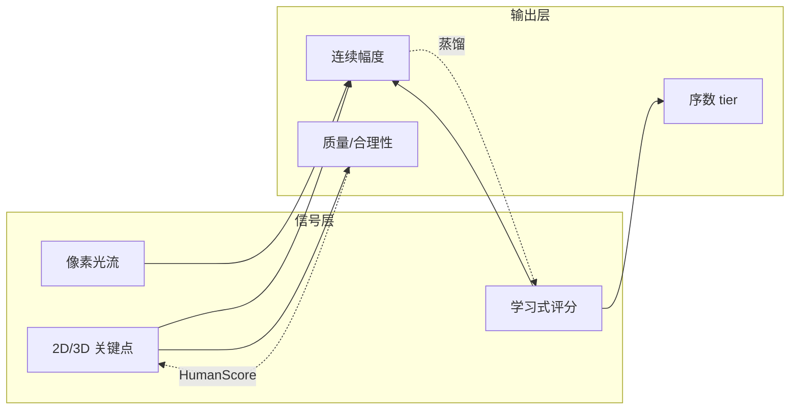

# 视频生成身体部位运动幅度检测算子研究报告

---

## 报告结构说明

本报告采用**双主线**组织：

| 主线 | 章节 | 回答的问题 |
|------|------|-----------|
| **文献综述** | 第 2–3 章 | 已有工作如何定义、分类和度量"运动/幅度"？彼此差异与互补关系是什么？ |
| **方法实践** | 第 4 章 | 在本仓库 benchmark 中实现了哪几条路线？在 Kinetics 子集上表现如何？ |
| **方案与展望** | 第 5 章 | 综合综述与实践，LMA 算子应如何分层构建？ |

---

## 1. 引言

生成式视频在视觉质量上取得了快速进展，但在运动层面仍面临巨大挑战：所生成内容的动力学、物理规律以及关节化人体的真实感普遍不足。在这一问题中，**身体部位运动幅度**——即面部、四肢、躯干与关节运动的幅度与剧烈程度——是一个重要却尚未被形式化的维度。

### 1.1 核心矛盾

- **动态程度与时间一致性的权衡。** VBench 等基准已明确观察到：高时间一致性（Subject/Background Consistency、Temporal Flickering）与高 Dynamic Degree 往往此消彼长 [1]。模型可通过生成近乎静止的视频在一致性维度"作弊"，反之强行追求大幅度又会引入抖动与物理不合理姿态。
- **指标语义与任务需求错位。** FVD [2] 侧重生成分布与真实分布的距离，且对逐帧内容存在偏置 [26]；VBench Dynamic Degree [1] 回答的是"够不够动态"而非"哪条肢体动得多"；HumanScore [3] 回答的是"动得是否生物力学合理"而非单纯的强度排序。现有指标 rarely 同时满足：**可解释、按部位、连续幅度、人类对齐**。

### 1.2 本报告贡献

1. 从**五种分类视角**梳理 20+ 项相关工作，并给出**多维度对比总表**（第 3 章）。
2. 给出**身体部位运动幅度**的操作性定义（第 2 章）。
3. 在 **motion-score-benchmark** 中实现光流、关键点、学习式三条路线，于 Kinetics-700 精选子集（229 clip）上对比（第 4 章）。
4. 提出面向 **LMA（Limb Motion Amplitude）** 的分层构建方案（第 5 章）。

---

## 2. 问题定义

### 2.1 术语辨析

文献中"运动"相关概念并不等价，本报告区分如下：

| 术语 | 典型问题 | 代表指标 |
|------|---------|---------|
| **动态程度（Dynamic Degree）** | 视频是否包含足够大的运动？ | VBench DD [1] |
| **运动强度（Motion Intensity）** | 运动有多剧烈？可否控制？ | Mojito [9]、MotionStone [12] |
| **运动质量（Motion Quality）** | 动得是否自然、平滑、符合常识？ | VMBench MSS/CAS [4]、VideoScore [13] |
| **运动一致性（Motion Consistency）** | 时序是否连贯、是否符合物理？ | FVMD [8]、VBench Motion Smoothness [1] |
| **生物力学合理性（Biomechanical Fidelity）** | 关节角、速度是否在生理范围内？ | HumanScore [3] |
| **身体部位运动幅度（LMA，本报告焦点）** | 各部位位移/角位移有多大？ | 尚无标准算子；HumanScore Joint Range 部分相关 |

### 2.2 操作性定义

本报告将**身体部位运动幅度**定义为：

> 在归一化时间与人体尺度下，各可活动部位（关节、骨段）的**位移或角位移统计量**（如峰值速度、活动范围 ROM、分位数位移）， optionally 与物理/生理约束联合报告。

该定义强调：（1）**部位级或骨架级**几何量优先于纯像素；（2）**时间统计**（非单帧）；（3）可与**感知或生物力学**校准，但幅度本身不等于"质量"。

### 2.3 理想算子应满足的属性

| 属性 | 说明 | 现状 |
|------|------|------|
| **部位可分解** | 输出头/躯干/四肢或关节组 | 多数工作为 clip 级标量 |
| **相机运动鲁棒** | 区分主体与背景/镜头运动 | PAS [4]、MotionStone [12] 显式处理；VBench DD 不区分 |
| **连续可读** | 0–1 或物理单位，非仅二值 | VBench DD 为二值；本项目 flow/pose 为连续 |
| **尺度归一化** | 消除分辨率、景别影响 | pose 框归一化、光流除以对角线 |
| **可复现** | 固定模型与超参 | 开源 benchmark 仍少 |
| **人类对齐** | 与 ordinal/连续人工评分相关 | 需万级标注（VideoScore）或成对比较（MotionStone） |

---

## 3. 文献综述：运动与幅度的度量方法

本章从**多种分类角度**梳理已有研究，避免仅用"关键点 / 光流 / 学习"一种划分；各角度交叉使用，同一工作可能落入多个类别。

### 3.1 五种分类视角

#### 视角 A：信号来源（技术路线）

| 类别 | 核心信号 | 代表工作 |
|------|---------|---------|
| 几何 / 骨架 | 2D/3D 关键点、SMPL-X、关节角 | HumanScore [3]、Motion-X [7]、FVMD [8]、THEval [6] |
| 像素 / 光流 | 稠密或稀疏光流、像素位移 | VBench DD [1]、Mojito [9]、SEA-RAFT [10] |
| 深度特征 | I3D、VideoMAE 等网络嵌入 | FVD [2]、Koala-36M VTSS [15] |
| 学习式评分 | 人工标注 → 回归/分类/RL 奖励 | VideoScore [13][14]、MotionCritic [11] |
| 梯度归因 | 训练样本对运动目标的梯度方向 | Motive [16] |
| 综合流水线 | 多模块串联 | VMBench [4]、WYD [17] |

#### 视角 B：评测任务与应用场景

| 场景 | 目标 | 典型工作 |
|------|------|---------|
| **文生视频（T2V）模型排名** | 16 维质量 + 动态程度 | VBench [1] |
| **运动感知对齐评测** | 五维 PMM + 人类偏好验证 | VMBench [4] |
| **生成人体运动质量** | 生物力学六指标 | HumanScore [3] |
| **可控 I2V / 角色动画** | 姿态驱动 + 运动强度条件 | Animate Anyone [20]、MotionStone [12] |
| **说话人 / 面部** | 头部位姿、唇部几何 | THEval [6] |
| **数据筛选与训练** | VTSS、Motive 归因 | Koala-36M [15]、Motive [16] |
| **RLHF / 奖励模型** | 模拟人类多维反馈 | VideoScore [13][14] |

#### 视角 C：空间与时间粒度

| 粒度 | 输出形式 | 局限 |
|------|---------|------|
| **Clip 级标量** | 单视频一个分数 | 无法定位"哪条肢体" |
| **帧对 / 帧序列** | 逐帧对光流或位移再聚合 | VBench top-5%、本项目 flow/pose |
| **关键点轨迹** | 每点速度/加速度分布 | FVMD [8]、PAS [4] |
| **关节 / 部位向量** | 肩/肘/髋等分组 ROM | HumanScore [3]（3D），尚未普及于 T2V 评测 |
| **分布级距离** | 生成集 vs 参考集 Fréchet 距离 | FVD [2]、FVMD [8] |

#### 视角 D：Ground Truth 与标注成本

| 标注类型 | 成本 | 代表 |
|---------|------|------|
| 无标注（启发式） | 低 | 光流阈值、ROM 查表 |
| 序数 tier / 动作类 | 低–中 | Kinetics 类语义、HumanScore 三档难度 |
| 绝对连续分（1–5） | 高 | VideoScore Dynamic Degree [13] |
| 成对比较（A vs B） | 中（易共识） | MotionStone ±2 级 [12]、MotionPercept [11] |
| 细粒度多维人工 | 很高 | WYD 56 子类 [17]、VideoFeedback2 [14] |
| 隐式（梯度/损失） | 无需幅度标注 | Motive [16]（但语义是影响力非幅度） |

#### 视角 E：是否显式建模"幅度" vs "质量"

许多工作名称含"motion"，但优化目标不同：

- **幅度导向：** VBench DD、PAS、Mojito MIM、MotionStone 强度头、本项目 `pose_motion` / `flow_*`。
- **质量导向：** HumanScore 六指标（含自碰撞、平滑度）、VMBench MSS/CAS/OIS、VideoScore 多维质量。
- **混合：** FVMD（运动分布相似度，兼含一致性语义）；WYD（动作 + 遮挡 + 相机等多维）。

---

### 3.2 多维度方法对比总表

下表汇总与本报告主题**最相关**的代表性工作（★ 表示与"幅度"直接相关度更高）。评价为文献中的设计取向，非本仓库复现实测。

| 工作 | 信号来源 | 主要输出 | 空间粒度 | 相机分离 | 连续幅度 | 人类对齐 | 部位分解 | 典型用途 | 与本项目关系 |
|------|---------|---------|---------|---------|---------|---------|---------|---------|-------------|
| VBench DD [1] | 光流 RAFT | 二值动态/静态 | Clip | ✗ | △ 可改连续 | 中 | ✗ | T2V 排名 | flow 算子继承 top-5% |
| VMBench PAS [4] | 追踪点+阈值 | 0–1 感知幅度 | 主体区域 | ✓ | ✓ | **高** | △ 主体级 | 运动评测 | 前景掩膜思路 |
| VMBench MSS/CAS/OIS [4] | 多种 | 质量分 | Clip/区域 | 部分 | — | 高 | ✗ | 质量非幅度 | 互补维度 |
| HumanScore [3] | 3D 骨架+OpenSim | 六维生物力学分 | **关节级** | △ | ✓ ROM | 高 | **✓** | 生成人体评测 | LMA 解剖层目标 |
| FVMD [8] | 关键点轨迹统计 | Fréchet 距离 | 轨迹分布 | △ | 分布级 | 高 | △ | 运动一致性 |  Unary 改造思路 |
| FVD [2] | I3D 特征 | 分布距离 | Clip | ✗ | ✗ | 中 | ✗ | 生成质量 | 内容偏置 [26] |
| VideoScore [13] | 多模态 LM | 1–4 分多维 | Clip | 隐式 | ✓ | **很高** | ✗ | RL 奖励 | learned 蒸馏参考 |
| MotionStone [12] | 视频+对比学习 | 物体/相机强度 | Clip | **✓** | ✓ | 高 | ✗ | I2V 控制 | 成对标注范式 |
| MotionCritic [11] | 骨架序列 | 质量标量 | 全身 | ✗ | ✓ | 高 | △ | 动作生成 | 感知损失参考 |
| Mojito [9] | 光流图 | 1–10 级强度 | 像素 | ✗ | ✓ | 中 | ✗ | 生成控制 | 光流离散化 |
| Motive [16] | 梯度+光流 mask | 影响力分数 | Clip | ✓ | ✗ | 低 | ✗ | 数据归因 | 非幅度算子 |
| WYD [17] | 光流+pose+分割 | 56 类+自动指标 | 多维度 | ✓ | △ | 高 | △ | I2V 人体评测 | 综合 benchmark |
| THEval [6] | 面部 landmark | 8 维+总分 | **面部** | ✗ | ✓ | **很高** | **✓ 脸** | 说话头评测 | tier-1 说话类补充 |
| OpenHumanVid [5] | DWPose 骨架 | 条件序列 | 2D 骨架 | ✗ | — | — | △ | 训练数据 | 骨架条件 |
| Motion-X [7] | SMPL-X | 3D 姿态序列 | **全身** | ✗ | ✓ | — | **✓** | 数据集/生成 | 3D LMA 数据层 |
| Koala-36M VTSS [15] | 学习式 | 训练适用性 | Clip | — | △ | 人工筛选 | ✗ | 数据过滤 | 数据工程 |
| **本项目 pose** | RTMO 2D | `pose_motion` | 全身关键点 | △ 尺度归一 | ✓ | 中(ρ≈0.49) | ✗ | benchmark | **已实践** |
| **本项目 flow** | SEA-RAFT | `flow_foreground` | 框内像素 | △ pose 框 | ✓ | 中(ρ≈0.40) | ✗ | benchmark | **已实践** |
| **本项目 learned** | VideoMAE | `learned_score` | Clip | 隐式 | ✓ | 高(ρ≈0.84)* | ✗ | benchmark | **已实践** |

\* `learned_score` 与 tier 标签高度相关，部分来自分类头对 tier 的记忆，不等同于独立人类幅度标注。

---

### 3.3 按技术路线的深入综述

#### 3.3.1 几何与骨架路线

**共同范式：** 检测/跟踪关键点或拟合参数化人体模型 → 计算位移、角速度或 ROM → 聚合为 clip 级或关节级分数。

**HumanScore [3]** 是当前与 LMA 概念最接近的生成视频评测框架。其将指标分为三层、六项：

| 层级 | 指标 | 与幅度的关系 |
|------|------|-------------|
| 解剖学正确性 | 多余肢体、骨骼长度恒定 | 质量，非幅度 |
| 运动学正确性 | **关节活动范围 Joint Range**、自碰撞 | **ROM 直接刻画幅度上界** |
| 动力学一致性 | 运动极值（速度上限）、平滑度 | 幅度过大且超生理极限则扣分 |

技术链：2D 视频 → HMR 2.0 等恢复 87 个 3D 解剖点 → SKELify 拟合 OpenSim 兼容骨骼 → 与预设生理 ROM 比较。数据集：51 种 Kinetics 动作 × 三档难度 × 轻柔/剧烈两种 prompt。该设计说明：**幅度评测可与"是否动得太大"（超 ROM）结合**，而非只看位移大小。

**VMBench PAS [4]** 不计算关节角，而计算**主体区域内追踪点的平均位移**，再与场景自适应感知阈值比较。流水线：GroundingDINO 定位 → GroundedSAM 时序掩膜 → CoTracker 轨迹 → 归一化得分。与 VBench DD 相比，PAS 显式**剥离相机运动、对齐人类感知**，Spearman 相对基线平均提升 35.3% [4]。

**FVMD [8]** 用 PIPs++ 跟踪关键点，提取速度/加速度直方图，以 Fréchet 距离比较生成视频与参考集的运动特征分布。原设计面向**生成集评测**；若改为单视频内部帧间特征方差或相邻片段距离，可近似**运动量变化**，但仍是分布语义而非绝对幅度。

**THEval [6]** 聚焦**面部**：pitch/yaw/roll、唇部几何距离、眉动等 8 维指标，Final Score 与人类评分 Spearman ρ≈0.87。对 tier-1「说话类」视频，全局 pose 算子易低估面部动态，THEval 提供了**部位 specialize** 的范例。

**Motion-X [7]** 主要贡献在**数据**：SMPL-X 全身 3D 标注流水线（ViT-WholeBody → 分区精修 → 置信度引导平滑）。对 LMA 而言，它是**3D 部位幅度**的潜在 ground truth 来源，而非现成 T2V 评测算子。

**OpenHumanVid [5]** 提供 DWPose 骨架序列作为生成条件，强调文本—外观—**运动**—面部四维对齐；验证大规模人体视频数据对生成质量的重要性，但未提出独立幅度算子。

**小结（几何路线）：** 语义最贴近 LMA，但 3D+OpenSim 成本高；2D 关键点速度（如本项目 `pose_motion`）是实用折中，缺关节角与部位分解。

#### 3.3.2 光流与像素路线

**VBench Dynamic Degree [1]：** RAFT 光流 → 每帧对 top-5% 幅度均值 → 与自适应阈值比较 → **视频级二值**（动态/静态）。模型级分数 = 动态视频占比。优点：简单、与 VBench 套件一致；缺点：**不区分相机/主体、非连续幅度、与 temporal consistency 负相关**。

**Mojito [9]：** Motion Intensity Modulator 将相邻帧灰度差/光流归一化并**离散为 1–10 级**，作为扩散模型条件。说明光流可编码强度，但是**控制信号**而非通用评测标准。

**SEA-RAFT [10]：** 光流**估计器**本身（Mixture of Laplace、跨数据集泛化），被本项目采用以替代 VBench 默认 RAFT，提升 Kinetics 等真实场景估计稳定性。

**小结（光流路线）：** 实现成本低、无需人体检测；**相机运动、非人体运动**是主要误差源。VMBench PAS 式主体分离 + top-5% 统计（本项目 `flow_foreground`）是常见改进路径。

#### 3.3.3 学习式与感知对齐路线

**VideoScore [13] / VideoScore2 [14]：** VideoFeedback（37.6K+ 视频、多维人工分）→ Mantis/Qwen-VL 微调 → 输出含 **Dynamic Degree（1–4 分）** 等多维分数。VideoScore2 增加 chain-of-thought，强调物理一致性与文本对齐。与幅度相关的是 Dynamic Degree 维度，但模型**联合优化多目标**，且依赖**大规模标注**——与本项目 ~230 clip 形成鲜明对比。

**MotionStone [12]：** 解决「绝对强度难标注」问题，采用**成对比较**：15 名标注员对随机视频对在**物体运动 / 相机运动**两维上打 ±2 五级分，用对比学习训练**解耦强度估计器**，再注入 I2V 扩散模型。对 LMA 启示：**相机与物体运动应分开报告**；成对标注可降本。

**MotionPercept / MotionCritic [11]：** 52K+ 人类偏好对 → DSTFormer critic → Bradley-Terry 损失。面向**动作生成质量**（自然、美感），非 Kinetics 级「动作幅度 tier」，但证明了**小 critic 可对齐人类排序**。

**Koala-36M VTSS [15]：** Training Suitability Assessment Network 综合多子指标预测视频是否适合训练，属**数据工程**而非 clip 幅度读数。

**小结（学习路线）：** 人类对齐最强，但标注与算力成本高；小数据易**过拟合 tier/分类**（本项目 learned 回归头即为案例）。

#### 3.3.4 梯度归因与其它

**Motive [16]：** 对视频扩散模型，用 **motion-weighted loss mask** 计算训练 clip 梯度与「目标运动查询集」梯度的余弦相似度，得到**正负影响力分数**。用于**筛选微调数据**、提升 VBench 动态程度与平滑度，但**高影响力 clip ≠ 高幅度 clip**——不宜直接当作 LMA。

**WYD [17]：** 1544 视频、56 细粒度类、9 大维度（动作、 locomotion、相机、遮挡等）；自动指标含光流运动量、pose 遮挡比例、分割 mask。是**综合评测 benchmark**，可借鉴其「光流 + pose + 人工细类」组合，但非单一幅度算子。

**FVD [2] 与内容偏置 [26]：** FVD 用 Kinetics 训练的 I3D 特征比较分布，对**时序破坏不敏感**，偏逐帧内容 [26]。说明**深度嵌入距离 ≠ 运动幅度**；VideoMAE 类自监督特征 [22] 时序敏感度更好，亦被本项目 learned 路线采用。

---

### 3.4 方法间的互补与张力



| 张力 | 表现 | 本项目的实证 |
|------|------|-------------|
| 幅度 vs 质量 | 动得大但超 ROM 仍应扣分 | 仅用 tier 作 GT，未评 HumanScore |
| 连续 vs 序数 | 分类易、回归难 | learned_score ρ=0.84 vs learned_motion ρ=0.38 |
| 全局 vs 部位 | 说话类面部大、肢体小 | pose 对 tier-1 可能偏低 |
| 主体 vs 相机 | 光流偏大 | flow_foreground < flow_global 仍混相机 |
| 小数据 learned vs 大标注 VideoScore | 蒸馏老师弱则回归 collapse | `--distill-target pose` 仍不足 |

---

### 3.5 综述小结：对 LMA 算子设计的启示

1. **没有单一"最佳"路线**：几何语义清、光流便宜、学习对齐强但需数据；实际系统多为**分层组合**（WYD、VMBench、HumanScore 均如此）。
2. **幅度算子至少应报告**：是否区分相机/物体、空间粒度（clip vs 部位）、输出是连续还是序数、GT 类型。
3. **与本项目选型一致的三条腿**：骨架速度（HumanScore/OpenHumanVid 2D 线）、前景光流（VBench+VMBench）、小数据蒸馏（VideoScore 思想的低配版）。
4. **明确未覆盖**：3D ROM（HumanScore 全链）、面部专用（THEval）、成对强度标注（MotionStone）、训练归因（Motive）。

---

## 4. 方法实践：Motion Magnitude Detection Benchmark

本章说明第 3 章综述中的**哪些思想被落地、实测表现如何**，与综述形成对照而非重复文献描述。

### 4.1 实践定位与文献映射

| 综述概念 | 本项目实现 |  deliberate 简化 |
|---------|-----------|-----------------|
| 骨架级幅度 | `pose_motion`（RTMO + 尺度归一化速度） | 无关节角、无分部位 |
| VBench top-5% 光流 | `flow_global` / `flow_foreground` | 连续值非二值；SEA-RAFT 非 RAFT |
| VMBench 主体分离 | pose 框掩膜 | 非 GroundingDINO+SAM |
| VideoScore 式学习评分 | VideoMAE 双头 + pose 蒸馏 | 无 VideoFeedback 规模标注 |
| HumanScore tier 设计 | Kinetics 15 类 × 3 tier | 无 51 类×双强度 prompt |
| 人类 1–5 分 GT | `human_rating_sheet.csv` 60 条 | **尚未填入** |

### 4.2 数据集

**来源：** Kinetics-700 [23][24]，每 tier 5 类、每类约 20 clip，共 **229 条**（`configs/classes.yaml`）。

| Tier | 语义 | 类别示例 |
|------|------|---------|
| 1 — low | 说话、小幅 upper-body | testifying, answering questions, … |
| 2 — medium | 结构化全身运动 | zumba, belly dancing, lunge, … |
| 3 — high | 高幅度/爆发 | boxing, wrestling, capoeira, … |

预处理：yt-dlp 下载 + ffmpeg 裁剪，8 fps，4–10 s。可选：`create_rating_sheet.py` 分层抽样 60 条供 1–5 分人工标注。

### 4.3 三种算子实现要点

#### 4.3.1 Pose — `src/pose_score.py`

- RTMO（rtmlib `Body`，ONNX GPU），720p 长边，8 fps。
- 多人 IoU 跟踪 → 关节位移 / **bbox 对角线**（尺度归一）→ 置信度加权 → 帧间 **mean_top2** → `pose_motion`。
- 副作用：输出 `pose_boxes.json` 供 flow 前景掩膜。

#### 4.3.2 Flow — `src/flow_score.py`

- SEA-RAFT [10]（`Tartan-C-T-TSKH432x960-M.pth` + `sintel-M.json`）。
- 每帧对：$\|\mathbf{f}\|/d$，top **5%** 均值；`flow_foreground` 在 pose 框内计算。

#### 4.3.3 Learned — `src/learned_score.py` + `src/train_learned.py`

- 骨干：`videomae-base-finetuned-kinetics` [22]；16 帧 × 224²。
- **分类头** → tier CE；**回归头** → 蒸馏 `pose_motion`（SmoothL1，λ=2）；**主分** `learned_score` = tier 概率期望 $0·P_1 + 0.5·P_2 + 1·P_3$。
- 默认 `--freeze-backbone`，checkpoint 按 combined 验证指标保存。

### 4.4 评估 — `src/evaluate.py`

- 各方法 min-max 归一化；`fused_motion` = 三者均值（**综述已指出：易被 learned 主导**）。
- 指标：Spearman/Kendall vs tier、learned_tier_accuracy、方法间相关、tier boxplot。

### 4.5 实验结果与对照解读

**条件：** 229 clip，主 GT = tier；无 filled human_rating。

| 方法 | Spearman ρ | Kendall τ | 对照综述预期 |
|------|-----------|-----------|-------------|
| pose | **0.491** | 0.391 | 几何路线应优于纯光流 ✓ |
| flow (foreground) | 0.397 | 0.314 | 相机污染仍限制表现 ✓ |
| learned_score | **0.842** | 0.713 | 小数据分类≈记 tier，非独立幅度 ⚠ |
| learned_motion | 0.379 | 0.310 | 蒸馏不足，符合 §3.3.3 讨论 ✓ |
| fused | 0.779 | 0.648 | learned 拉高 fused ✓ |
| learned_tier_acc | **89.5%** | — | 序数易、连续难 ✓ |

**方法间 Spearman：** flow–pose 0.61；learned–pose 0.49；learned–flow 0.42。

**失效模式（呼应 §3.4）：**

- tier-2/3 混淆（dance vs combat 2D 速度重叠）。
- tier-1 说话：面部动态大、肢体小 → pose 低估（THEval 可补）。
- 回归头 collapse → 支持 MotionStone/VideoScore 式**更多或成对标注**。

### 4.6 实践 vs 综述总表（本仓库实测列）

| 维度 | VBench DD | VMBench PAS | 本项目 pose | 本项目 flow | 本项目 learned |
|------|-----------|-------------|-------------|-------------|----------------|
| Spearman vs tier（本数据） | 未测 | 未测 | **0.49** | 0.40 | 0.84* |
| 相机分离 | ✗ | ✓ | △ | △ | 隐式 |
| 连续输出 | △ | ✓ | ✓ | ✓ | ✓ |
| 复现成本 | 低 | 高 | 中 | 中高 | 中高 |
| 部位分解 | ✗ | △ | ✗ | ✗ | ✗ |

\* 对 tier 标签相关，含分类记忆成分。

### 4.7 复现

环境：Python 3.10+、CUDA、ffmpeg、SEA-RAFT、`onnxruntime-gpu` only。详见 `README.md`。

```bash
python -m src.pose_score --labels data/labels.csv --output results/pose_scores.csv --boxes-json results/pose_boxes.json --device cuda
python -m src.flow_score --labels data/labels.csv --output results/flow_scores.csv --boxes-json results/pose_boxes.json --backend sea-raft --device cuda
python -m src.train_learned --labels results/fused_training_scores.csv --output checkpoints/learned_motion.pt --freeze-backbone --distill-target pose --device cuda
python -m src.learned_score --labels data/labels.csv --checkpoint checkpoints/learned_motion.pt --output results/learned_scores.csv --device cuda
python -m src.evaluate --labels data/labels.csv --score-csv results/flow_scores.csv --score-csv results/pose_scores.csv --score-csv results/learned_scores.csv --output results/scores.csv --metrics results/metrics.json --plots-dir results/plots
```

---

## 5. LMA 算子方案与展望

综合 **§3 综述** 与 **§4 实践**，建议 LMA 按五层构建，并避免简单平均融合（实践已验证 learned 主导 fused）。

| 层级 | 内容 | 文献依据 | 实践状态 |
|------|------|---------|---------|
| L0 解剖 ROM | 关节角 vs 生理范围 | HumanScore [3] | 未做 |
| L1 3D/2D 部位几何 | 分肢体 ROM/速度 | Motion-X [7]、THEval 脸 [6] | 2D 全局速度 ✅ |
| L2 主体光流 | 前景 top-k% 光流 | VBench [1] + PAS [4] | 框掩膜 ✅ |
| L3 感知校准 | 1–5 分或成对比较 | VideoScore [13]、MotionStone [12] | 表已建，未标注 |
| L4 融合 | 部位向量 + 标定 MLP | WYD [17] 多维思想 | 仅 clip 级 fused |

**优先事项：**（1）填完 60 条 human_rating，重训 `--distill-target human`；（2）pose 按 upper/lower body 分组输出；（3）PAS 式 mask 替换 pose 框；（4）tier-1 子集上对比 THEval 面部指标。

---

## 参考文献

[1] Z. Huang, Y. He, J. Yu, et al. **VBench: Comprehensive Benchmark Suite for Video Generative Models.** CVPR, 2024. arXiv:2311.17982. https://arxiv.org/abs/2311.17982

[2] T. Unterthiner, S. van Steenkiste, K. Kurach, et al. **Towards Accurate Generative Models of Video: A New Metric & Challenges (Fréchet Video Distance).** arXiv:1812.01717, 2018. https://arxiv.org/abs/1812.01717

[3] Y. Fang, T. Xiang, T. Tan, et al. **HumanScore: Benchmarking Human Motions in Generated Videos.** arXiv:2604.20157, 2026. https://arxiv.org/abs/2604.20157

[4] X. Ling, C. Zhu, M. Wu, et al. **VMBench: A Benchmark for Perception-Aligned Video Motion Generation.** ICCV, 2025. arXiv:2503.10076. https://arxiv.org/abs/2503.10076

[5] H. Li, M. Xu, Y. Zhan, et al. **OpenHumanVid: A Large-Scale High-Quality Dataset for Enhancing Human-Centric Video Generation.** CVPR, 2025. arXiv:2412.00115. https://arxiv.org/abs/2412.00115

[6] N. Quignon, B. Chopin, Y. Wang, A. Dantcheva. **THEval: Evaluation Framework for Talking Head Video Generation.** CVPR Findings, 2026. arXiv:2511.04520. https://arxiv.org/abs/2511.04520

[7] J. Lin, A. Zeng, S. Lu, et al. **Motion-X: A Large-scale 3D Expressive Whole-body Human Motion Dataset.** NeurIPS, 2023. arXiv:2307.00818. https://arxiv.org/abs/2307.00818

[8] J. Liu, Y. Qu, Q. Yan, et al. **Fréchet Video Motion Distance: A Metric for Evaluating Motion Consistency in Videos.** arXiv:2407.16124, 2024. https://arxiv.org/abs/2407.16124

[9] X. He, S. Wang, J. Yang, et al. **Mojito: Motion Trajectory and Intensity Control for Video Generation.** arXiv:2412.08948, 2024. https://arxiv.org/abs/2412.08948

[10] Y. Wang, L. Lipson, J. Deng. **SEA-RAFT: Simple, Efficient, Accurate RAFT for Optical Flow.** ECCV, 2024. arXiv:2405.14793. https://arxiv.org/abs/2405.14793

[11] H. Wang, W. Zhu, L. Miao, et al. **Aligning Human Motion Generation with Human Perceptions (MotionPercept / MotionCritic).** ICLR, 2025. arXiv:2407.02272. https://arxiv.org/abs/2407.02272

[12] S. Shi, et al. **MotionStone: Decoupled Motion Intensity Modulation with Diffusion Transformer for Image-to-Video Generation.** CVPR, 2025. arXiv:2412.05848. https://arxiv.org/abs/2412.05848

[13] X. He, D. Jiang, G. Zhang, et al. **VideoScore: Building Automatic Metrics to Simulate Fine-grained Human Feedback for Video Generation.** EMNLP, 2024. arXiv:2406.15252. https://arxiv.org/abs/2406.15252

[14] X. He, D. Jiang, P. Nie, et al. **VideoScore2: Think before You Score in Generative Video Evaluation.** arXiv:2509.22799, 2025. https://arxiv.org/abs/2509.22799

[15] Q. Wang, Y. Shi, J. Ou, et al. **Koala-36M: A Large-scale Video Dataset Improving Consistency between Fine-grained Conditions and Video Content.** CVPR, 2025. arXiv:2410.08260. https://arxiv.org/abs/2410.08260

[16] X. Wu, D. Paschalidou, J. Gao, et al. **Motion Attribution for Video Generation (Motive).** arXiv:2601.08828, 2026. https://arxiv.org/abs/2601.08828

[17] E. Bugliarello, A. Arnab, R. Paiss, et al. **What Are You Doing? A Closer Look at Controllable Human Video Generation (WYD).** arXiv:2503.04666, 2025. https://arxiv.org/abs/2503.04666

[18] T. Jiang, P. Lu, L. Zhang, et al. **RTMPose: Real-Time Multi-Person Pose Estimation based on MMPose.** arXiv:2303.07399, 2023. https://arxiv.org/abs/2303.07399

[19] P. Lu, T. Jiang, Y. Li, et al. **RTMO: Towards High-Performance One-Stage Real-Time Multi-Person Pose Estimation.** arXiv:2312.07526, 2023. https://arxiv.org/abs/2312.07526

[20] L. Hu, X. Gao, P. Zhang, et al. **Animate Anyone: Consistent and Controllable Image-to-Video Synthesis for Character Animation.** CVPR, 2024. arXiv:2311.17117. https://arxiv.org/abs/2311.17117

[21] Z. Teed, J. Deng. **RAFT: Recurrent All-Pairs Field Transforms for Optical Flow.** ECCV, 2020. arXiv:2003.12039. https://arxiv.org/abs/2003.12039

[22] Z. Tong, Y. Song, J. Wang, L. Wang. **VideoMAE: Masked Autoencoders are Data-Efficient Learners for Self-Supervised Video Pre-Training.** NeurIPS, 2022. arXiv:2203.12602. https://arxiv.org/abs/2203.12602

[23] W. Kay, J. Carreira, K. Simonyan, et al. **The Kinetics Human Action Video Dataset.** arXiv:1705.06950, 2017. https://arxiv.org/abs/1705.06950

[24] J. Carreira, E. Noland, C. Hillier, A. Zisserman. **A Short Note on the Kinetics-700 Human Action Dataset.** arXiv:1907.06987, 2019. https://arxiv.org/abs/1907.06987

[25] J. Carreira, A. Zisserman. **Quo Vadis, Action Recognition? A New Model and the Kinetics Dataset (I3D).** CVPR, 2017. arXiv:1705.07750. https://arxiv.org/abs/1705.07750

[26] J. Ge, Y. Song, K. Ma, et al. **On the Content Bias in Fréchet Video Distance.** CVPR, 2024. arXiv:2404.12391. https://arxiv.org/abs/2404.12391

---

*本报告对应开源仓库：`motion-score-benchmark`。实验结果：`results/metrics.json`、`results/scores.csv`、`results/plots/`。*
